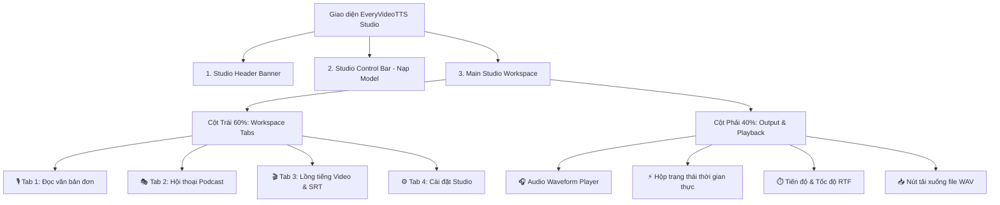

# 🎨 Tài Liệu Thiết Kế Giao Diện EveryVideoTTS Studio (design.md)

---

## 📌 1. Tổng Quan & Triết Lý Thiết Kế
* **Tên ứng dụng:** **EveryVideoTTS Studio**
* **Mục tiêu UX/UI:** Tạo ra trải nghiệm phòng thu âm thanh AI (Studio-Grade AI Audio Suite) chuyên nghiệp, trực quan và tốc độ cao.
* **Phong cách chủ đạo:** **Modern Studio Glassmorphism & Precision Dark/Light Theme**.
* **Đặc trưng thị giác:**
  - Tối giản các chi tiết thừa, tập trung vào luồng công việc (Workflow-Driven Design).
  - Sử dụng hệ thống màu sắc HSL chiều sâu, viền mờ siêu mỏng (Subtle Borders) và đổ bóng nổi đa tầng (Layered Elevation).
  - Hoàn toàn tương thích và hiển thị liền mạch trên cả giao diện Sáng (Light) và Tối (Dark).

---

## 📐 2. Hệ Thống Design System & Tokens (`apps/ui_constants.py`)

### 🅰️ Typography
* **Primary Fonts:** `Plus Jakarta Sans`, `Inter`, `system-ui`, `sans-serif`
* **Monospace Font:** `JetBrains Mono`, `ui-monospace`
* **Phân cấp kiểu chữ (Type Hierarchy):**
  - **App Title (Hero):** 1.85rem (29.6px), Font-weight 800, Letter-spacing `-0.03em`.
  - **Section / Tab Headers:** 1.1rem (17.6px), Font-weight 700.
  - **Input Labels & Card Titles:** 0.95rem (15.2px), Font-weight 600.
  - **Body / Content Text:** 0.9rem (14.4px), Line-height 1.6.
  - **Badge / Metadata Text:** 0.82rem (13.1px), Font-weight 600.

### 🎨 Color Palette & HSL Tokens
| Phân loại | Mã màu chính | Ứng dụng |
| :--- | :--- | :--- |
| **Primary Accent** | `#4f46e5` ➔ `#2563eb` (Indigo - Blue) | Nút bấm chính (Action Buttons), Tab đang chọn, Viền tiêu điểm |
| **Success Status** | `#10b981` / `#6ee7b7` (Emerald) | Badge chất lượng 48 kHz, Trạng thái Model đã nạp thành công |
| **Warning / Notice** | `#f59e0b` / `#fbbf24` (Amber) | Cảnh báo tương thích phần cứng, Ghi chú định dạng |
| **Danger / Stop** | `#ef4444` / `#fca5a5` (Rose) | Nút Dừng khẩn cấp (`⏹️ Dừng xử lý`) |
| **Studio Header Surface** | `#090d16` ➔ `#111827` ➔ `#1e1b4b` | Nền Gradient không gian phòng thu với ánh sáng khuếch tán |
| **Card Surface (Light)** | `#ffffff` (Border: `#e2e8f0`) | Thẻ điều khiển, Hộp nhập liệu, Khung hiển thị |
| **Card Surface (Dark)** | `#0f172a` (Border: `#1e293b`) | Chế độ nền tối chuyên nghiệp, giảm mỏi mắt |

---

## 🏗️ 3. Kiến Trúc Bố Cục Giao Diện (Layout Hierarchy)

Giao diện được xây dựng trên lưới chuẩn `max-width: 1440px` chia làm 2 cột bất đối xứng (60% Input / 40% Output) giúp người dùng vừa thao tác dữ liệu vừa theo dõi trực tiếp kết quả âm thanh.

---

## 🔍 4. Chi Tiết Các Khối Giao Diện & Thành Phần

### 🌟 4.1. Studio Header (`.studio-header`)
* **Logo & Nhận diện:** Biểu tượng 🎬 bo góc tinh tế kèm tên thương hiệu **EveryVideoTTS Studio** và phụ đề định vị sản phẩm.
* **Metadata Chips:**
  - `👤 Tác giả: Tyr` (Liên kết GitHub).
  - `⭐ VieNeu-TTS-Studio` (Liên kết mã nguồn gốc).
  - `⚡ 48 kHz Studio Quality` (Badge chất lượng cao).

---

### 🎛️ 4.2. Studio Control Bar (`.control-panel-card`)
Gộp toàn bộ tùy chọn nạp mô hình vào một thanh ngang tối giản:
* **Dropdown Chọn Mô Hình (Backbone):** `VieNeu-TTS-v3-Turbo` (mặc định), `VieNeu-TTS-v2 (GPU)`, `VieNeu-TTS-v2 (CPU)`, `Custom Model`.
* **Dropdown Audio Codec:** Tự động chọn `VieNeu-Codec` hoặc `NeuCodec`.
* **Radio Chọn Thiết Bị (Device):** Tự động nhận diện `Auto`, `CUDA (NVIDIA RTX 5070)`, `CPU`.
* **Nút Tải Model (`btn-primary-action`):** Kích hoạt nạp trọng số mô hình lên VRAM/RAM.
* **Hộp Trạng Thái Nạp:** Hiển thị chi tiết Backend, Device, Codec và tính năng tối ưu hóa.

---

### 🎙️ 4.3. Tab 1: Đọc Văn Bản (Single TTS)
* **Khung soạn thảo văn bản:** Tự động co giãn dòng, hỗ trợ nhập liệu dài và chuẩn hóa chính tả tiếng Việt.
* **Thanh gợi ý Tag Cảm Xúc (Quick Emotion Chips):**
  - `😄 [cười]`, `🗣️ [hắng giọng]`, `💨 [thở dài]`.
* **Trích xuất văn bản từ PDF (Accordion):** Tải lên tài liệu PDF và tự động trích xuất nội dung vào khung soạn thảo.
* **Bộ chọn Giọng đọc:**
  - *Chế độ Preset:* Dropdown danh sách giọng mẫu phong phú (Bình, Tuyên, Vĩnh, Đoan, Ly, Ngọc, Review 1, Review 2...).
  - *Chế độ Voice Cloning:* Tải lên audio mẫu 3–5s kèm tùy chọn `🔇 Khử nhiễu nền`.
* **Nút hành động:** `✨ Bắt đầu tạo giọng nói`.

---

### 🎭 4.4. Tab 2: Hội Thoại Podcast Đa Nhân Vật
* **Trình soạn thảo kịch bản đối thoại:** Định dạng chuẩn `Tên nhân vật: Lời thoại`.
* **Nút Quét nhân vật (`🔍 Quét nhân vật`):** Tự động phân tích kịch bản và trích xuất danh sách nhân vật.
* **Bảng phân vai nhân vật (Speaker Mapping):** Lên đến 8 nhân vật với ô tên và dropdown chọn giọng đọc tương ứng.
* **Thanh trượt Khoảng lặng (Silence Slider):** Điều chỉnh khoảng nghỉ tự nhiên giữa các lượt nói (0.0s – 3.0s).
* **Nút hành động:** `🎭 Bắt đầu tạo hội thoại`.

---

### 🎬 4.5. Tab 3: Lồng Tiếng Video & Phụ Đề SRT (SRT Studio)
* **Banner Công Nghệ WSOLA:** Giới thiệu thuật toán kéo dãn âm thanh miền thời gian chống rè.
* **Khu vực nạp SRT:** Hỗ trợ kéo thả file `.srt` / `.txt` hoặc dán trực tiếp nội dung phụ đề có timestamp.
* **Nút Quét & Phân Tích SRT:** Tự động kiểm tra số lượng câu, mốc thời gian và nhận diện nhân vật trong phụ đề.
* **Bảng phân vai nhân vật trong SRT:** Gán giọng mẫu riêng cho từng nhân vật xuất hiện trong phụ đề video.
* **Thanh điều khiển Căn chỉnh & Tốc độ (Auto Speed Matching):**
  - *Chế độ căn chỉnh Timeline:* `Strict Sync` (Khớp chính xác từng giây phụ đề) / `Sequential` (Nối tiếp).
  - *Chế độ Speed Matching:*
    1. `⚡ Tự động tăng tốc khi câu đọc bị tràn (Khuyên dùng)`: Tự động phát hiện câu đọc dài hơn thời lượng hiển thị phụ đề và tăng tốc mượt mà bằng WSOLA.
    2. `⏱️ Khớp chính xác thời lượng từng câu (Fit Exact)`: Ép khớp 100% thời lượng slot phụ đề.
    3. `⛔ Giữ nguyên tốc độ giọng gốc`: Không thay đổi tốc độ đọc.
  - *Thanh trượt Giới hạn tốc độ tối đa:* Giới hạn mức tăng tốc (1.0x – 3.0x) để đảm bảo độ rõ chữ.
* **Nút hành động:** `🎬 Bắt đầu lồng tiếng SRT`.

---

### ⚙️ 4.6. Tab 4: Cài Đặt Studio (Hardware & Inference Settings)
* **GPU Parallel Batching:**
  - Slider `📊 Batch Size (Generation)`: Cho phép cấu hình từ `1` đến `64` luồng xử lý song song trên GPU RTX 5070.
* **Temperature Slider:** Điều chỉnh mức độ sáng tạo / cảm xúc của giọng đọc (0.1 – 1.5).
* **Max Chars per Chunk:** Tối ưu hóa kích thước phân đoạn văn bản (128 – 512 ký tự).

---

### 🎧 4.7. Cột Kết Quả & Phát Âm Thanh (Output Area)
* **Trình phát Audio Waveform:** Hỗ trợ phát trực tiếp, tua nhanh, chỉnh âm lượng và tự động phát khi tạo xong (`autoplay=True`).
* **Hộp Trạng thái Xử lý (`.status-box`):** Hiển thị chi tiết số câu hoàn thành, số lô batch và thời gian thực hiện.
* **Hộp Đo lường Tiến độ & Tốc độ (`.estimate-box`):** Hiển thị chỉ số Real-Time Factor (RTF), ví dụ: `Tốc độ: 25.4x realtime`.
* **Nút Tải xuống File Audio (`download_btn`):** Tải về file `.wav` 48 kHz chuẩn phòng thu.
* **Nút Dừng Khẩn Cấp (`btn_stop`):** Ngắt tiến trình sinh audio ngay lập tức mà không làm treo hệ thống.
* **Ghi chú Bản quyền:** Thông báo đóng dấu âm thanh AI bảo mật (Audio Watermarking).

---

## 📱 5. Tính Năng Responsive & Khả Năng Tiếp Cận
* **Desktop (≥ 1200px):** Bố cục 2 cột song song (60/40), hiển thị toàn bộ thanh điều khiển và trình phát cùng lúc.
* **Tablet / Laptop (768px – 1199px):** Tự động co giãn lề và khoảng cách các thẻ, giữ nguyên tỷ lệ tương tác.
* **Mobile (< 768px):** Tự động chuyển đổi thành bố cục dọc 1 cột (Stack Layout), các nút bấm mở rộng toàn màn hình (`width: 100%`) để thuận tiện thao tác chạm.
